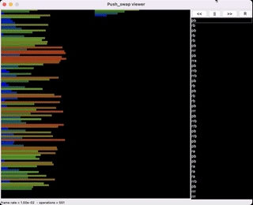
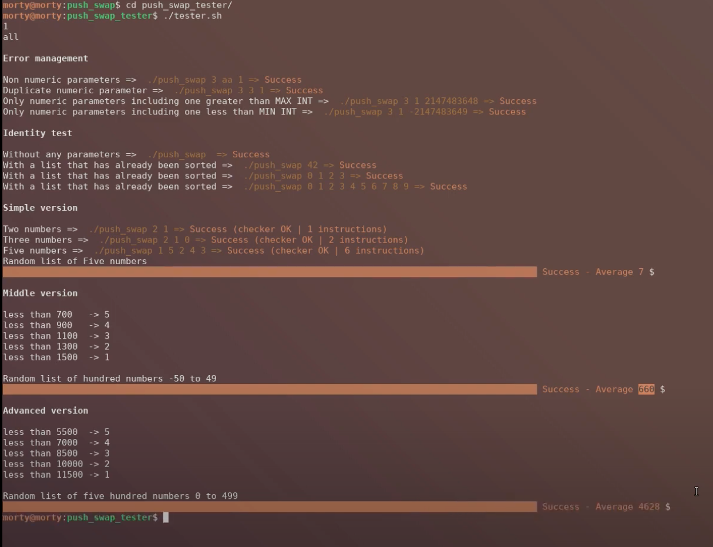

---

see todo list

#### Gestion des cas d'erreur dans le parsing
- [x] Attention `./push_swap` sans arg ne renvoie rien il semblerait (**voir avec le checker**). Moi je renvoie une erreur.
  - C'est bon je ne renvoie rien. Pas d'arguments = liste triée wesh.
- [x] Int passé > `int max` ou < `int min`
- [x] Argument n'est pas un int
- [x] Plusieurs chiffres dans un string ""
- [x] Apparemment " " doit renvoyer Error, et " " 5 4 aussi.
- [x] Mais est-ce que "4 " 3 2 1 doit renvoyer 0 aussi ? Chez moi oui.
- [x] Int en double
  - Au lieu de faire une fonction séparée qui vérifiera ma liste une fois toutes les valeurs parsées, c'est ma fonction de parsing qui devra checker ça au fur et à mesure.
- [x] Créer une fonction ft_is_sorted qui verifie si la liste est deja triee et si c'est le cas je renvoie 0 puisqu'il m'y a rien a faire.

#### Détails techniques généraux
- [ ] Bien verifier que mes operations ne font rien quand elles ne sont pas censees (genre swap ou rotate une liste de 1)
- [ ] Attention, si je change un truc dans la libft et que je make avec mon makefile principal ca remake pas la libft. Il faut que je rajoute le make -C libft dans la make principal je pense.
- [ ] Faire les unit tests pour mes operations (push, rotate etc... Surtout avec les double linked lists)
- [ ] Idem pour lstlen
- [ ] Je crois que j'ai rien free du tout là. Mais normalement je perds rien donc je peux tout free à la fin.
  - Il faudra que je free: stack_b (?), la linked list the coûts dans chaque maillon de stack_a, et stack_a.
- [ ] Push_swap utils: too many functions in file
- [ ] J'ai un peu fait le fou dans ma fonction set_stack_as_sorted, verifier que ca fonctionne bien.
- [ ] Renomer ft_set_stack_as_sorted
- [x] Virer toutes les fonctions de la libft que je n'utilise pas !
- [ ] Virer le -g flag du makefile

---

# Introduction

The Push_swap project is a very simple and highly effective algorithm project: data will need to be sorted.  
You have at your disposal a set of int values, 2 stacks and a set of instructions to manipulate both stacks.

Write a program in C called push_swap which calculates and displays on the standard output the smallest program using Push_swap instruction language that sorts the integer arguments received.

This project will make you sort data on a stack, with a limited set of instructions, using
the lowest possible number of actions.

To succeed you’ll have to manipulate various types of algorithms and choose the one (of many) most appropriate solution for an optimized data sorting.

---
# Rules & Requirements

Rules <i>(click to open)</i>

The game is composed of **2 stacks** named `stack_a` and `stack_b`. 

To start with:
+ `stack_a` contains a random amount of negative and/or positive numbers which cannot be duplicated.
+ `stack_b` is empty 

The **goal** is to sort in ascending order numbers into `stack_a`.

To do this you have the following **operations** at your disposal:
  

|       | Operation        | Description                                                                                      |
|-------|------------------|--------------------------------------------------------------------------------------------------|
| `sa`  | swap a           | swap the first 2 elements at the top of `stack_a`. Do nothing if there is only one or no elements) |
| `sb`  | swap b           | swap the first 2 elements at the top of `stack_b`. Do nothing if there is only one or no elements) |
| `ss`  | sa & sb          | at the same time.                                                                                |
| `pa`  | push a           | take the first element at the top of b and put it at the top of `stack_a`. Do nothing if `stack_b` is empty.     |
| `pb`  | push b           | take the first element at the top of `stack_a` and put it at the top of `stack_b`. Do nothing if `stack_a` is empty.     |
| `ra`  | rotate a         | shift up all elements of `stack_a` by 1. The first element becomes the last one.                   |
| `rb`  | rotate b         | shift up all elements of `stack_b` by 1. The first element becomes the last one.                   |
| `rr`  | `ra` & `rb`      | at the same time.                                                                                |
| `rra` | reverse rotate a | shift down all elements of `stack_a` by 1. The last element becomes the first one.                 |
| `rrb` | reverse rotate b | shift down all elements of `stack_b` by 1. The last element becomes the first one.                 |
| `rrr` | `rra` & `rrb`    | at the same time.                                                                                |

### Error handling

In case of error, you must display `Error` followed by a `\n` on the standard error.

**Errors include for example:**
- [x] some arguments aren’t integers
- [x] some arguments are bigger than an integer
- [x] there are duplicates.

Requirements <i>(click to open)</i>

| Item                | Requirement                                                                                                                                                                                      |
|:--------------------|:-------------------------------------------------------------------------------------------------------------------------------------------------------------------------------------------------|
| **Files to submit** | This project will only be corrected by actual human beings. You are therefore free to organize and name your files as you wish, although you need to respect some requirements listed below. |
| Makefile            | The Makefile needs to compile the project and must contain the usual rules. It can only recompile the program if necessary.                                                                  |
| Libft allowed       | Yes                                                                                                                                                                                              |
| Functions allowed   | write, read, malloc, free, exit                                                                                                                                                                  |
| Learning objectives | Rigor Use of C Use of basic algorithms                                                                                                                                                   |

---
# My Approach

 

(<b>List</b>: 100 – <b>Operations</b>: 551)
  

# Algorithm Efficiency

[Tests spreadsheet](https://docs.google.com/spreadsheets/d/1kVyRijv79XmJY1otm2J91d5ZcBccza-yDX8xMglieaM/edit#gid=0)

<table><thead><tr><th rowspan="3">List length </th><th colspan="4">Operations</th></tr><tr><th rowspan="2">Max allowed  to get bonus</th><th colspan="3">My algorithm</th></tr><tr><th>Average</th><th>Min</th><th>Max</th></tr></thead><tbody><tr><td><b>3</b></td><td>3</td><td></td><td></td><td></td></tr><tr><td><b>5</b></td><td>12</td><td></td><td></td><td></td></tr><tr><td><b>100</b></td><td>700</td><td></td><td></td><td></td></tr><tr><td><b>500</b></td><td>5500</td><td></td><td></td><td></td></tr></tbody></table>

---
# A VIRER

### Notions

+ [Mon algo au final](https://github.com/terngkub/push_swap)
+ [Visualisateur d'algos](http://lwh.free.fr/pages/algo/tri/tri.htm)
+ Concept of [complexity/analysis of algorithms](https://en.wikipedia.org/wiki/Analysis_of_algorithms).
+ [Ditto](https://www.google.com/search?client=safari&rls=en&q=Analysis+of+algorithms&ie=UTF-8&oe=UTF-8).
+ What is a [stack](https://en.wikipedia.org/wiki/Stack_(abstract_data_type)).

> Sorting values is simple. To sort them the fastest way possible is less simple, especially
**because from one integers configuration to another, the most efficient sorting algorithm
can differ.**

---

### Ma stratégie

Je pense que je vais d'abord essayer d'implémenter Quicksort, et s'il n'est pas assez opti sur les petits nombres peut-être que j'en coderai un second plus optimisé, genre Bucket sort.  
Il faudra donc que je fasse un max de tests pour voir à partir de combien d'arguments il faut passer de l'un à l'autre.

[Sur internet](https://stackoverflow.com/questions/33704858/sorting-2-linked-list-of-50000-numbers-with-a-limited-set-of-operations) on parle aussi de faire un mix entre QuickSort et [merge sort](https://www.youtube.com/watch?v=dENca26N6V4).

#### Understanding QuickSort

[QuickSort Visualisation <3](https://opendsa-server.cs.vt.edu/embed/quicksortAV)
[Sorting Algorithms Animations](https://www.toptal.com/developers/sorting-algorithms)

[Short video](https://www.youtube.com/watch?v=Hoixgm4-P4M) | [Clear video 💖](https://www.youtube.com/watch?v=7h1s2SojIRw) with [details](https://www.youtube.com/watch?v=-qOVVRIZzao)

In QuickSort, an element is considered ✅**sorted** if it checks the following conditions:
- [x] All elements to its left are **smaller** than it
- [x] All elements to its right are **bigger** than it.

[Quick sort VS Bucket sort – Which is faster ?](https://smartbear.com/blog/bucket-sort-vs-quick-sort-which-is-faster-aqtime-b/)  
-> Quand il y a beaucoup de nombres c'est quick sort, quand il y en a moins c'est bucket sort. Peut-être implémenter les deux ?
-> Il semblerait que le probleme de quicksort soit aussi les cas ou les listes sont deja presque triees. [Introspective sort](https://en.wikipedia.org/wiki/Introsort) serait [capable d'y parrer](https://stackoverflow.com/a/220171) il semblerait.
-> Une idee serait d'écrire une fonction "smart rotate" comme décrit [ici](https://github.com/AdrianWR/push_swap), qui calcule toute seule la maniere la moins "couteuse" de ramener un nombre vers le haut.

[Lui il utilise quicksort puis insertion (video)](https://www.youtube.com/watch?v=9LifznRAZQY)

[42 requirements + implementation of raddix sort](https://medium.com/nerd-for-tech/push-swap-tutorial-fa746e6aba1e)

Je donne a chaque element de la stack un boolean "is_sorted", qui m'aidera à "diviser" les segments à foutre a droite pour les trier.
- [ ] Est-ce que je mets un boolean "is pivot" aussi ? Pour identifier les pivots? Mais si je fais ca, autant utiliser juste un seul boolean "is_pivot" puisque par definition, les elements qui ont ete pivots sont sorted. Oui mais pendant le tri je serai bien content de pouvoir differencier les deux.

<!--
### Listes à 3 chiffres

Pour les listes à 3 chiffres, il y a 6 combinaisons possibles: 

| #1 	 |     #2 	     | #3 	| #4 	| #5 	| #6 	|
|:----:|:------------:|:---:	|:---:	|:---:	|:---:	|
| 1 	  |     3 	      | 2 	| 3 	| 1 	| 2 	|
| 2 	  |     2 	      | 1 	| 1 	| 3 	| 3 	|
| 3 	  |     1 	      | 3 	| 2 	| 2 	| 1 	|
| ⭐	  |`sa` `rra` 	 | `sa` 	| `ra` 	| `sa` `ra` 	| `rra` 	|
-->

[from discord, easiest to understand per a student](https://medium.com/@jamierobertdawson/push-swap-the-least-amount-of-moves-with-two-stacks-d1e76a71789a)

Algo super bien explique (github)

[click me](https://github.com/VBrazhnik/Push_swap/wiki/Algorithm) 💗

Recommandes par Amina

[#1](https://github.com/balkisous/push_swap)  
[#2](https://github.com/ttranche/push_swap) (_celui-ci donne comme exemple l'algo super bien explique juste au-dessus_)

<!-- 
---

### Checker script
 -->

---

### Notes

+ Pour exécuter le prog: `./push_swap (arguments) | wc -l`
+ Pour pouvoir voir la priorité des opérateurs en exam: `man operator`
+ Mieux comprendre ce qui se passe à la compilation: [ici](https://moodle.campusafrica.gos.orange.com/pluginfile.php/1430/mod_resource/content/1/lecon1/co/Module_lecon1_3.html). [(c.f.)](https://discord.com/channels/774300457157918772/817041043764805692/933063036296630342)
+ [Quick sort for double linked lists](https://www.geeksforgeeks.org/quicksort-for-linked-list/).
+ Lire [ce README](https://github.com/terngkub/push_swap) pour comprendre le concept d'attribution de coût aux opérations de tri.
+ Certains utilisent les [listes chaînées circulaires](https://chgi.developpez.com/dblist/liste.gif) ou les [listes doublement chaînées](https://chgi.developpez.com/dblist/), intéressant.

---

### Testeurs / Ressources

+ [42_Corrections](https://github.com/Binary-Hackers/42_Corrections)
+ [Push_swap_algorithm (PDF)](subject/push_swap_algorithm.pdf)

#### Trucs à tester

Argument parsing

-1 (ok)  
+1 (ok)  
+2147483647 (ok)  
-2147483648 (ok)  
+2147483648 (error car > max int)  
-2147483649 (error car < min int)  
-/+ seuls (doit renvoyer une erreur, a verifier en comparant avec le checker)  
123432b (error)  
"1 3 4354j" (error)  
"" (moi ca renvoie rien mais je pense que ca devrait me mettre une erreur puisque si j'appelle le prog sans rien il m'en met une)  
" " (doit renvoyer error normalement, puisque l'espace est un char)  
1 2 3 4 3 (error)  
1 2 3 "4 5 6" (ok)  
1 2 3 "4 5 6 1" (error)  
1 2 3 -4 (ok)  
1 2 3-4 (error)  
"-4 4" 5 4 (ok)  
" " 5 4 (???) moi ca me met KO, parce qu'il n'y a aucun chiffre  
"  " 5 4 (???) idem  
"  4" 3 2 (???) moi ca me met ok

Operations / Actions

- [ ] Verifier ce que font les actions sur des listes de 2, 3... (swap ne marchait pas sur des listes de 2 par exemple)
- [ ] Verifier que le len du premier maillon de chaque chaine est toujours a jou.

---

### FAQ

Click to open

> J'ai code un generaeur mais impossible de passer ce qu'il produit a mon programme qui cossidere la liste come une seule chaine de charactere quelque chose comme ca "1 2 3 4 5"
Donc je me demande si c'est moi qui sait pas trop me servir de bash et que je fais quelque chose de travers ou si mon push_swap est sense gerer les chaines "1 2 3 4 5" comme une liste de 5 chiffres
> > Le sujet est sous bash, il comprendra que chaque chiffre est un argument différent et non une chaine de caractères. Alors que zsh le comprend comme une seule chaîne de caractères
> > > Si jamais, c'est possible de le faire avec zsh aussi, il faut utiliser l'option shwordsplit avec setopt shwordsplit directement dans le terminal
>
> > Ou soit au lieu de ./push_swap $ARG tu écris sous zsh ./push_swap ${=ARG}

> Yo, est ce que avoir un argument avec plusieurs espace est valide pour push swap ?
exemple : "1 5                3 4"
> > Le sujet ne porte pas vraiment sur le parsing des arguments mais sur de l algo, donc tant que ton programme ne crash pas et que tu justifies ton choix je pense que c est bon

> quelqu'un sait comment inclure sa libft au projet ? je dois avoir 2 makefile ou bien un makefile qui compile le makefile de la libft ?
>> il suffit davoir un dossier libft avec tes srcs / headers + le makefile de ta libft a linterieur, puis en supposant que le Makefile de ton projet se trouve a la racine de celui ci, pour ocmpiler ta lib c make -C libft
et si tu veux clean / fclean / re ta libft c make clean -C libft etc

> Hello si on a respectivement 2/5 et 3/5 pour 100 arguments et 500 arguments, vous pensez que le projet est validé ?
>> Pour avoir 84, il faut 3 et 4 / 5  
Je pense que 80 est sur un 3 et 3.
>
>> Si j'ai bien compris si on a 0 et 0 et tout le reste bon c'est 50. À ça il faut ajouter 6% par point au 100 et 4% par point au 500.  
>> De source sûre : (0, 0) donne 50,(3,4) donne 84, (4,3) donne 86, (5,3) donne 92, c'est à partir de ces chiffres que j'ai déduit ça

> Hello, puisqu'on est évalué sur max 500 arguments, est-ce que c'est ok si j'exit le programme si ce nombre est dépassé ou il faut le gérer quand-même ?
>> Il faut le gérer quand même. Même si il n y a pas de barème. Il peut même y avoir de int min à int max en arguments.

> Euh ça va vous sembler bête mais s'il y a qu'un seul nombre en paramètre ./push_swap 1, vous avez choisi de le gérer comment ?
>> la pile est triée si y a qu un nombre ;)

> Je place ça là, ça peux aider : je me suis embêté à try pleins d'algos "complique" (pr mon ptit cerveau) et j'étais toujours un peu au dessus de 700 et 5500. Puis j'ai trouve un mec sur git, j'ai littéralement lu 3 lignes de son readme; je me suis exclamé c'est du génie ! et sans mm regarder son code j'ai recode tte la partie algo en très peux de temps (pas le main et la gestion des op donc) et j'ai 100% partt. En fait c'est d'une simplicité enfantine : c'est du caclcul de coût. Tu pa deux fois puis tu calcul CB ça te coûte d'insérer le premier NB de a ds b (le monter TT en haut + préparer B à l'accueillir + 1 pr push). Puis tu fais le mm calcul sur TT A et à la fin tu inséré celui qui "coûte le moins cher" dans B. Il y beaucoup plus opti car la ce n'est que coup par coup sans visions globale mais pour 100 int je suis toujours en dessous de 700 et pr 500 int sur 10 000 test une ou deux fois je suis au dessus mais bon mathématiquement il y a peu de chance qu'un correcteur tombe sur ce cas là car mon algo met 1 bonne sec à s'exécuter pr 500 nbr dc 10 000 tests je vous laisse faire le calcul...
De mon point de vue de TT les algos que j'ai try (chunk, etc...) c'est le plus opti enfin celui qui m'a permis d'avoir 125% quoi et paradoxalement le plus simple que j'ai eu à coder.
Bien plus simple que ceux avec les chunks par ex.
À noter que B est toujours trie mais pas forcément avec le début de la liste en haut : par ex : B :
9
10
1
2
3
4
5  
> [Le git du mec en question](https://github.com/terngkub/push_swap)

[Astuce pour "sa et "sb"](https://discord.com/channels/774300457157918772/817041043764805692/931964330667298937)

---

 

